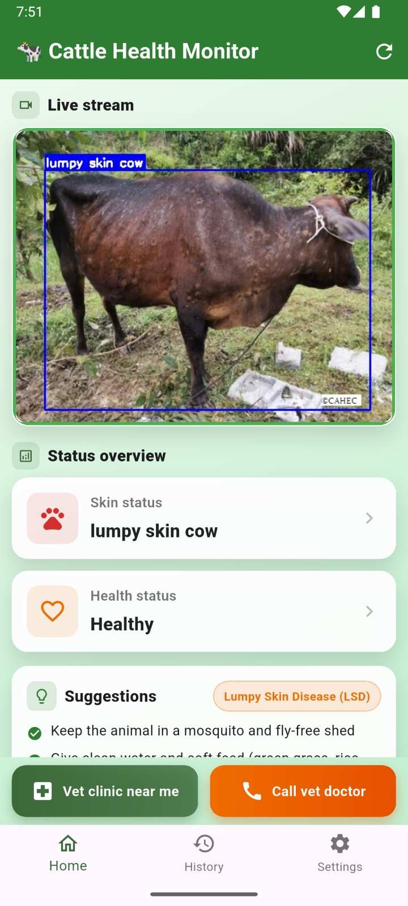
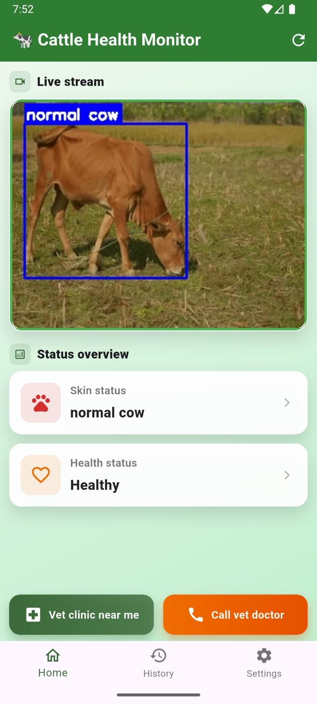
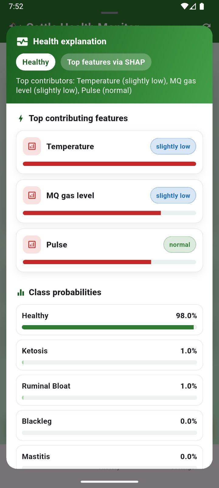
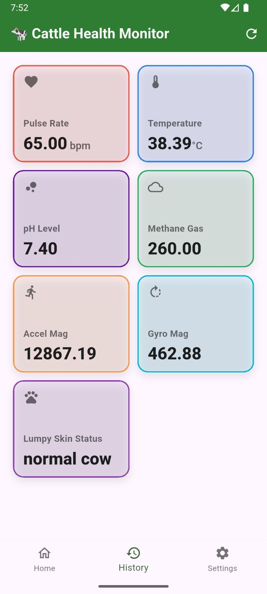

## 📱 VetCare Mobile Application

VetCare provides a mobile application for real-time cattle health monitoring.
The application connects the IoT sensing and AI-based diagnostic modules
through a FastAPI backend and provides health predictions, sensor monitoring,
and explainable AI results in an easy-to-use interface.

### Application Screenshots

| LSD Detection – Infected Cow | LSD Detection – Healthy Cow |
|:---:|:---:|
|  |  |

| SHAP-Based Health Explanation | Sensor Reading History |
|:---:|:---:|
|  |  |

The mobile application provides:

- 🐄 **LSD Detection** – identifies normal and lumpy-skin-disease cattle
  from camera images/video.
- 🌡️ **Physiological Monitoring** – displays temperature, pulse, methane,
  saliva pH, acceleration, and gyroscope measurements.
- 🤖 **AI-Based Disease Prediction** – Random Forest predicts physiological
  health conditions from multi-sensor data.
- 🔍 **SHAP Explainability** – shows the most influential physiological
  features behind a prediction.
- 📊 **Sensor History** – provides historical sensor measurements.
- 🚨 **Health Alerts** – presents detected health conditions and suggested
  actions.
- 📡 **Real-Time Monitoring** – receives sensor and image-processing results
  through the backend.